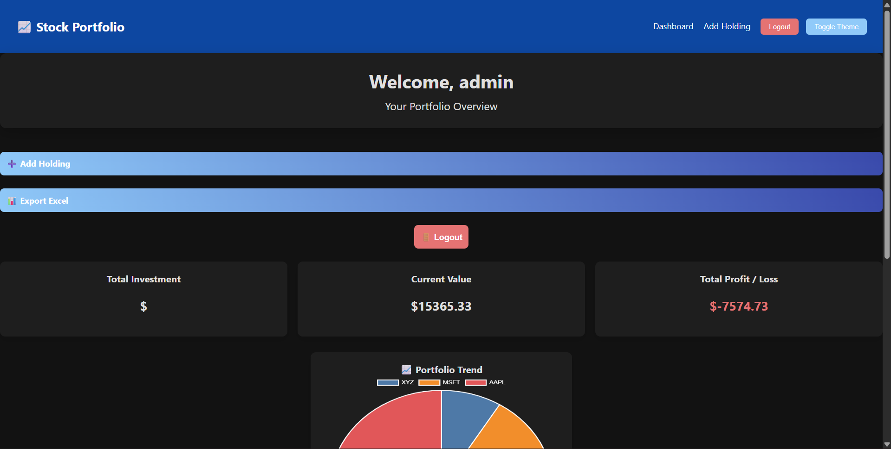
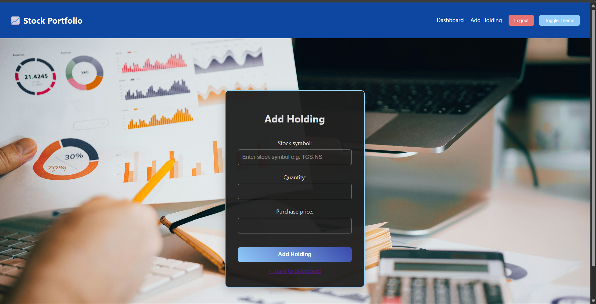
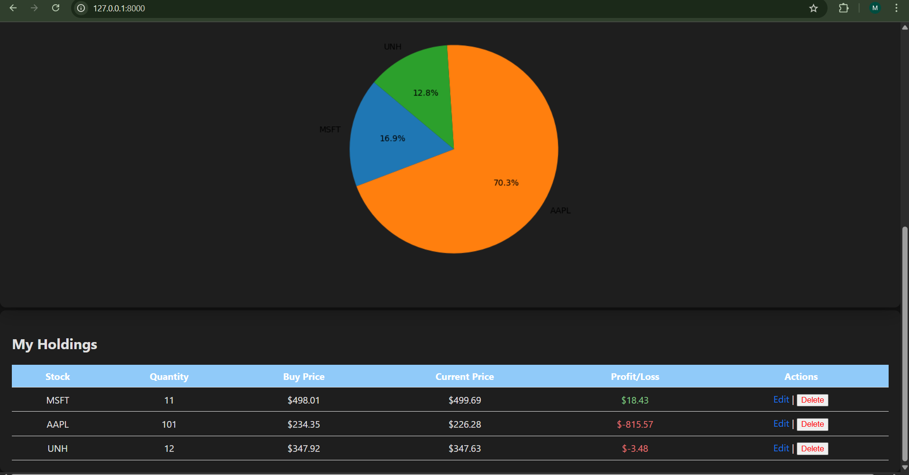
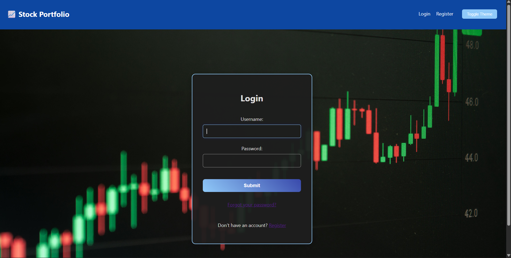

# Stock Portfolio Tracker Project

A Django-based web application to track your stock portfolio with real-time prices, portfolio charts, and Excel export. Fully mobile responsive and supports dark/light mode.

---

## Tech Stack
- **Python 3.x**  
- **Django 5.x**  
- **MySQL**  
- **yfinance** (for stock prices)  
- **Matplotlib** (for charts)  
- **HTML, CSS, JavaScript**

---

## Features
- Dashboard with portfolio summary  
- Add/Edit/Delete Holdings  
- Portfolio Trend Chart (Pie chart of holdings)  
- Profit/Loss color coding (Green for profit, Red for loss)  
- Export portfolio to Excel  
- Dark/Light mode toggle  
- Fully mobile responsive  
- Password reset functionality  
- Login/Register functionality  

---

## Screenshots

**Dashboard**  

**Add Holding**  

**Portfolio Chart**  

**Login Page**  

---

## How to Run Locally

1. Clone the repository:

git clone https://github.com/Mayank14-03/stock_portfolio_project.git

2. Go into the project folder:

cd stock_portfolio_project

3. Create and activate a virtual environment:

python -m venv venv
# Windows
venv\Scripts\activate
# Mac/Linux
source venv/bin/activate

4. Install requirements:

pip install -r requirements.txt

5. Configure MySQL database in settings.py:

DATABASES = {
    'default': {
        'ENGINE': 'django.db.backends.mysql',
        'NAME': 'your_database_name',
        'USER': 'your_mysql_user',
        'PASSWORD': 'your_mysql_password',
        'HOST': 'localhost',
        'PORT': '3306',
    }
}

6. Apply migrations:

python manage.py migrate

7. Create a superuser:

python manage.py createsuperuser

8. Run the development server:

python manage.py runserver

9. Open in browser:
http://127.0.0.1:8000/

Notes:

Screenshots folder: Create a folder named /stock_portfolio/screenshots/ in your repo and add the images there.

.gitignore: Make sure to exclude venv/, __pycache__/, .env, and other local files.

Repo name: For consistency, rename your GitHub repository to match your project folder (stock_portfolio_project).

Author:

Mayank Korde
GitHub | LinkedIn

